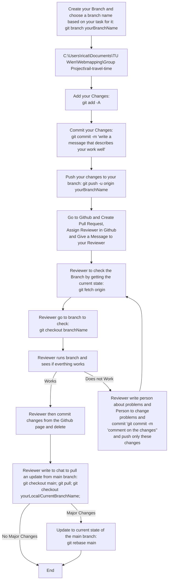

# Flowchart for Our Workflow on Git

# Further rules

*  If you created a pull request and your reviewer is working on it, then do not push new other changes to the same branch.
*  If you need to change something on the current pull request, push only the commit the changes.
*  Create branches based on tasks and when startin a new task, create a new branch.
*  When doing a pull request, then checkout away from this branch locally, so it can be nicely deleted later.
*  Do not put passwords in plain text (or do not push them then).
*  When we update main branch, we can rebase, especially when the changes are fundamental.
